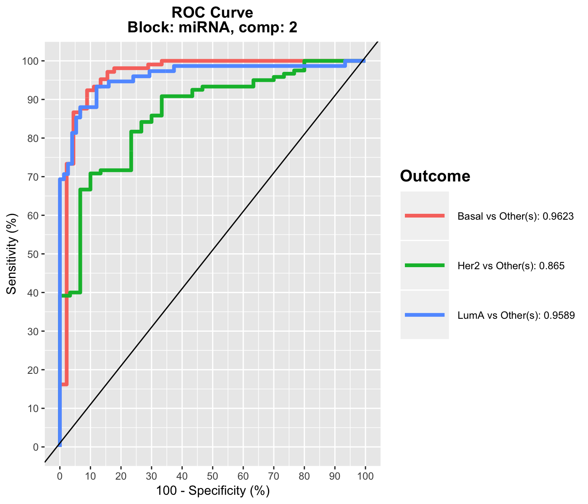

# Principal Component Analysis (PCA) {#pca}


## Biological question
<span style="color:blue">
*I would like to identify the major sources of variation in my data and itdentify whether such sources of variation correspond to biological conditions, or experimental bias. I would like visualise trends or patterns between samples,whether they 'naturally' cluster according to known biological conditions.* 
</span>

## The `liver.toxicity` study

The `liver.toxicity` is a list in the package that contains:

- `gene`: a data frame with 64 rows and 3116 columns, corresponding to the expression levels of 3,116 genes measured on 64 rats.

- `clinic`: a data frame with 64 rows and 10 columns, corresponding to the measurements of 10 clinical variables on the same 64 rats.

- `treatment`: data frame with 64 rows and 4 columns, indicating the treatment information of the 64 rats, such as doses of acetaminophen and times of necropsy.

- `gene.ID`: a data frame with 3116 rows and 2 columns, indicating geneBank IDs of the annotated genes.

More details are available at `?liver.toxicity`.


To illustrate PCA, we focus on the expression levels of the genes in the data frame `liver.toxicity$gene`. Some of the terms mentioned below are listed in \@ref(intro:background).

## Principle of PCA

The aim of PCA [@Jol05] is to reduce the dimensionality of the data whilst retaining as much information as possible. 'Information' is referred here as *variance*. The idea is to create uncorrelated artificial variables called *principal components* (PCs) that combine in a linear manner the original (possibly correlated) variables (e.g. genes,  metabolites, etc.).

Dimension reduction is achieved by projecting the data into the space spanned by the principal components (PC). In practice, it means that each sample is assigned a score on each new PC dimension - this score is calculated as a linear combination of the original variables to which a weight is applied. The weights of each of the original variables are stored in the so-called *loading vectors* associated to each PC. The dimension of the data is reduced by projecting the data into the smaller subspace spanned by the PCs, while capturing the largest sources of variation between samples.

The principal components are obtained by maximising the variance-covariance matrix of the data. To that end, we calculate the eigenvectors/eigenvalues of the variance-covariance matrix, often via singular value decomposition when the number of variables is very large. The data are usually centred (`center = TRUE`), and sometimes scaled (`scale = TRUE`) in the method. The latter is especially advised in the case where the variance is not homogeneous across variables.

The first PC is defined as the linear combination of the original variables that explains the greatest amount of variation. The second PC is then defined as the linear combination of the original variables that accounts for the greatest amount of the remaining variation subject of being orthogonal (uncorrelated) to the first component. Subsequent components are defined likewise for the other PCA dimensions. The user must therefore report how much information is explained by the first PCs as these are used to graphically represent the PCA outputs.


## Load the data
We first load the data from the package. See \@ref(start:upload) to upload your own data. 

```r
library(mixOmics)
data(liver.toxicity)
X <- liver.toxicity$gene
```

## Quick start

```r
MyResult.pca <- pca(X)     # 1 Run the method
plotIndiv(MyResult.pca)    # 2 Plot the samples
```

```r
plotVar(MyResult.pca)      # 3 Plot the variables
```

If you were to run `pca` with this minimal code, you would be using the following default values:

- `ncomp =2`: the first two principal components are calculated and are used for graphical outputs;
- `center = TRUE`: data are centred (mean = 0)
- `scale = FALSE`: data are not scaled. If `scale = TRUE`  standardizes each variable (variance = 1).

Other arguments can also be chosen, see `?pca`. 

This example was shown in Chapter \@ref(start:PCA). The two plots are not extremely meaningful as specific sample patterns should be further investigated and the variable correlation circle plot plot contains too many variables to be easily interpreted. Let's improve those graphics as shown below to improve interpretation. 


## To go further

### Customize plots

Plots can be customized using numerous options in `plotIndiv` and `plotVar`. For instance, even if PCA does not take into account any information regarding the known group membership of each sample, we can include such information on the sample plot to visualize any `natural' cluster that may corresponds to biological conditions.

Here is an example where we include the sample groups information with the argument `group`:


```r
plotIndiv(MyResult.pca, group = liver.toxicity$treatment$Dose.Group, 
          legend = TRUE)
```


Additionally, two factors can be displayed using both colours (argument `group`) and symbols (argument `pch`). For example here we display both Dose and Time of exposure and improve the title and legend:


```r
plotIndiv(MyResult.pca, ind.names = FALSE,
          group = liver.toxicity$treatment$Dose.Group,
          pch = as.factor(liver.toxicity$treatment$Time.Group),
          legend = TRUE, title = 'Liver toxicity: genes, PCA comp 1 - 2',
          legend.title = 'Dose', legend.title.pch = 'Exposure')
```


By including information related to the dose of acetaminophen and time of exposure enables us to see a cluster of low dose samples (blue and orange, top left at 50 and 100mg respectively), whereas samples with high doses (1500 and 2000mg in grey and green respectively) are more scattered, but highlight an exposure effect. 

To display the results on other components, we can change the `comp` argument provided we have requested enough components to be calculated. Here is our second PCA with 3 components:


```r
MyResult.pca2 <- pca(X, ncomp = 3)
plotIndiv(MyResult.pca2, comp = c(1,3), legend = TRUE,
          group = liver.toxicity$treatment$Time.Group,
          title = 'Multidrug transporter, PCA comp 1 - 3')
```


Here, the 3rd component on the y-axis clearly highlights a time of exposure effect. 

### Amount of variance explained and choice of number of components
The amount of variance explained can be extracted with the following: a screeplot or the actual numerical proportions of explained variance, and cumulative proportion.


```r
plot(MyResult.pca2)
```


```r
MyResult.pca2
```

```
## Eigenvalues for the first 3 principal components, see object$sdev^2: 
##       PC1       PC2       PC3 
## 17.971416  9.079234  4.567709 
## 
## Proportion of explained variance for the first 3 principal components, see object$explained_variance: 
##        PC1        PC2        PC3 
## 0.35684128 0.18027769 0.09069665 
## 
## Cumulative proportion explained variance for the first 3 principal components, see object$cum.var: 
##       PC1       PC2       PC3 
## 0.3568413 0.5371190 0.6278156 
## 
##  Other available components: 
##  -------------------- 
##  loading vectors: see object$rotation
```

There is no clear guidelines on how many components should be included in PCA: it is data dependent and the level of noise. We often look at the `elbow' on the screeplot above as an indicator that the addition of PCs does not drastically contribute to explain the remainder variance.

### Other useful plots

We can also have a look at the variable coefficients in each component with the loading vectors.  The loading weights are represented in decreasing order from bottom to top in `plotLoadings`. Their absolute value indicates the importance of each variable to define each PC, as represented by the length of each bar. See `?plotLoadings` to change the arguments.


```r
# a minimal example
plotLoadings(MyResult.pca)
```


```r
# a customized example to only show the top 100 genes 
# and their gene name
plotLoadings(MyResult.pca, ndisplay = 100, 
             name.var = liver.toxicity$gene.ID[, "geneBank"],
             size.name = rel(0.3))
```

Such representation will be more informative once we select a few variables in the next section \@ref(sPCA).


Plots can also be displayed in 3 dimensions using the option `style="3d"`, and interactively (we use the `rgl` package for this).


```r
plotIndiv(MyResult.pca2,
          group = liver.toxicity$treatment$Dose.Group, style="3d",
          legend = TRUE, title = 'Liver toxicity: genes, PCA comp 1 - 2 - 3')
```

## Variable selection with sparse PCA {#sPCA}

### Biological question
<span style="color:blue"> 
*I would like to apply PCA but also be able to identify the key variables that contribute to the explanation of most variance in the data set* 
</span>


Variable selection can be performed using the sparse version of PCA implemented in `spca` [@She08]. The user needs to provide the number of variables to select on each PC. Here for example we ask to select the top 15 genes contributing to the definition of PC1, the top 10 genes contributing to PC2 and the top 5 genes for PC3 (`keepX=c(15,10,5)`).


```r
MyResult.spca <- spca(X, ncomp = 3, keepX = c(15,10,5))                 # 1 Run the method
plotIndiv(MyResult.spca, group = liver.toxicity$treatment$Dose.Group,   # 2 Plot the samples
          pch = as.factor(liver.toxicity$treatment$Time.Group),
          legend = TRUE, title = 'Liver toxicity: genes, sPCA comp 1 - 2',
          legend.title = 'Dose', legend.title.pch = 'Exposure')
```


```r
plotVar(MyResult.spca, cex = 1)                                        # 3 Plot the variables
```


```r
# cex is used to reduce the size of the labels on the plot
```

Selected variables can be identified on each component with the `selectVar` function. Here the coefficient values are extracted, but there are other outputs, see `?selectVar`:


```r
selectVar(MyResult.spca, comp = 1)$value
```

```
##                value.var
## A_43_P20281  -0.39077443
## A_43_P16829  -0.38898291
## A_43_P21269  -0.37452039
## A_43_P20475  -0.32482960
## A_43_P20891  -0.31740002
## A_43_P14037  -0.27681845
## A_42_P751969 -0.26140533
## A_43_P15845  -0.22392912
## A_42_P814129 -0.18838954
## A_42_P680505 -0.18672610
## A_43_P21483  -0.16202222
## A_43_P21243  -0.13259471
## A_43_P22469  -0.12493156
## A_43_P23061  -0.12255308
## A_43_P11409  -0.09768656
```

Those values correspond to the loading weights that are used to define each component. A large absolute value indicates the importance of the variable in this PC. Selected variables are ranked from the most important (top) to the least important. 

We can complement this output with `plotLoadings`. We can see here that all coefficients are negative.


```r
plotLoadings(MyResult.spca)
```



If we look at component two, we can see a mix of positive and negative weights (also see in the `plotVar`), those correspond to variables that oppose the low and high doses (see from the `plotIndiv):


## Tuning parameters

For this set of methods, two parameters need to be chosen:

- The number of components to retain,
- The number of variables to select on each component for sparse PCA.

The function `tune.pca` calculates the percentage of variance explained for each component, up to the minimum between the number of rows, or column in the data set. The `optimal' number of components can be identified if an elbow appears on the screeplot. In the example below the cut-off is not very clear, we could choose 2 components.


Regarding the number of variables to select in sparse PCA, there is not clear criterion at this stage. As PCA is an exploration method, we prefer to set arbitrary thresholds that will pinpoint the key variables to focus on during the interpretation stage.


## Additional resources

Additional examples are provided in `example(pca)` and in our case studies on our [website](http://www.mixomics.org) in the **Methods** and **Case studies** sections.

Additional reading in [@She08].


## FAQ

* Should I scale my data before running PCA? (`scale = TRUE` in `pca`)
    + Without scaling: a variable with high variance will solely drive the first principal component
    + With scaling: one noisy variable with low variability will be assigned the same variance as other meaningful variables


* Can I perform PCA with missing values?
    +  NIPALS ( Non-linear Iterative PArtial Least Squares - implemented in mixOmics ) can impute missing values but must be built on many components. The proportion of NAs should not exceed 20% of total data.


* When should I apply a multilevel approach in PCA? (`multilevel` argument in `PCA`)
    + When the unique individuals are measured more than once (repeated measures)
    + When the individual variation is less than treatment or time variation. This means that samples from each unique individual will tend to cluster rather than the treatments.
    + When a multilevel vs no multilevel seems to visually make a difference on a PCA plot
    + More details in this [case study](http://mixomics.org/case-studies/multilevel-vac18/)


* When should I apply a CLR transformation in PCA? (`logratio = 'CLR'` argument in `PCA`)
    + When data are compositional, i.e. expressed as relative proportions. This is usually the case with microbiome studies as a result of pre-processing and normalisation, see more details [here](http://mixomics.org/mixmc/) and in our case studies in the same tab. 
