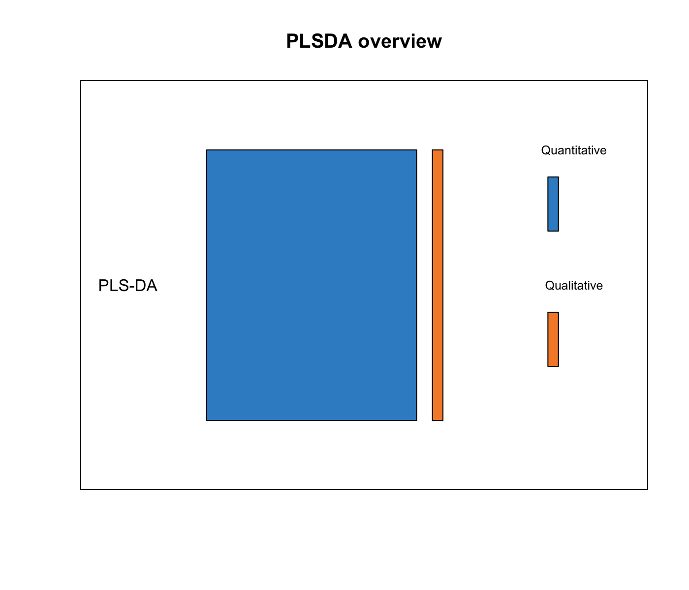
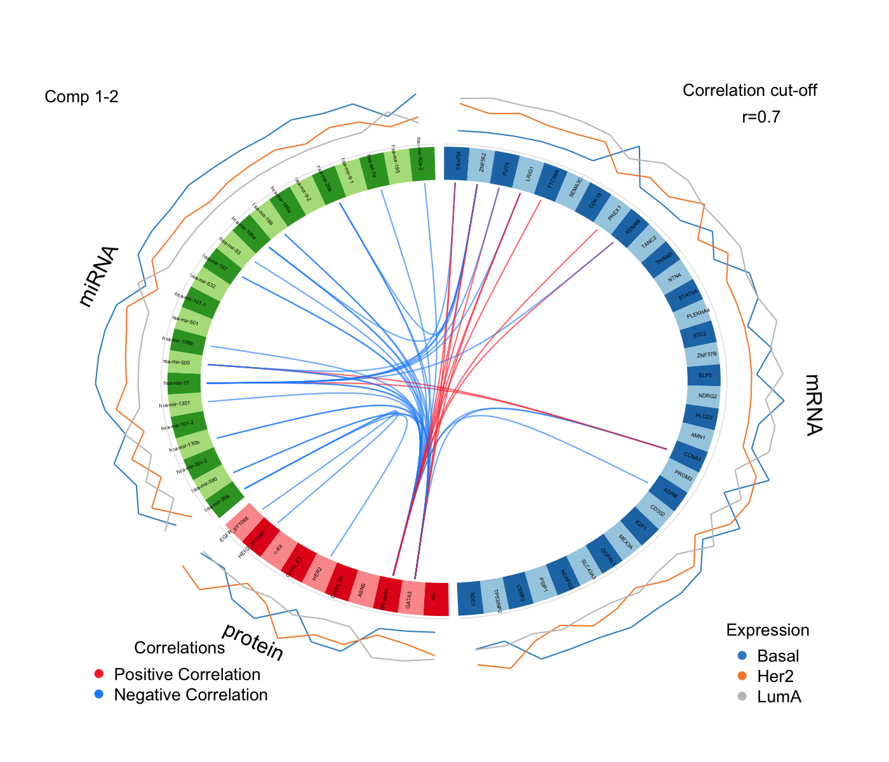
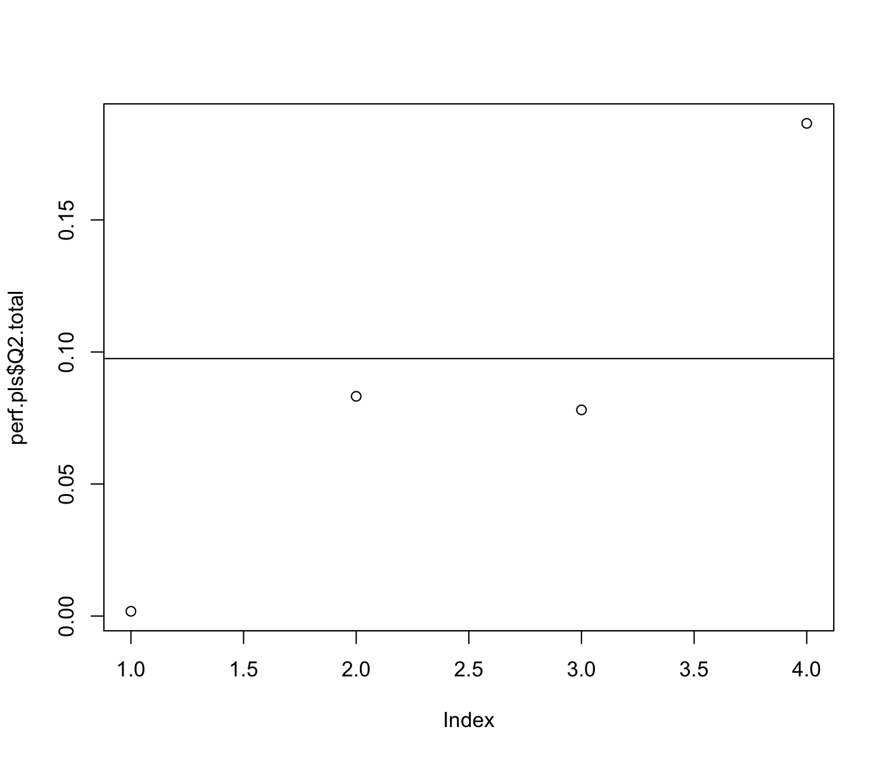
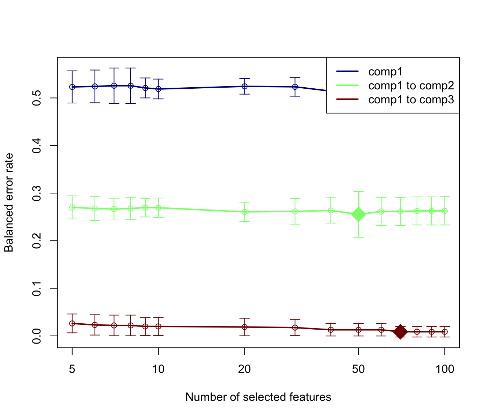

# PLS - Discriminant Analysis (PLS-DA) {#plsda}





## Biological question
<span style="color:blue">
*I am analysing a single data set (e.g. transcriptomics data) and I would like to classify my samples into known groups and predict the class of new samples. In addition, I am interested in identifying the key variables that drive such discrimination.*
</span>

## The `srbct` study

The data are directly available in a processed and normalised format from the package. The Small Round Blue Cell Tumours (SRBCT) dataset from [@Kha01] includes the expression levels of 2,308 genes measured on 63 samples. The samples are classified into four classes as follows: 8 Burkitt Lymphoma (BL), 23 Ewing Sarcoma (EWS), 12 neuroblastoma (NB), and 20 rhabdomyosarcoma (RMS).

The srbct dataset contains the following:

**$gene:** a data frame with 63 rows and 2308 columns. The expression levels of 2,308 genes in 63 subjects.

**$class:** a class vector containing the class tumour of each individual (4 classes in total).

**$gene.name:** a data frame with 2,308 rows and 2 columns containing further information on the genes.

More details can be found in `?srbct`.

To illustrate PLS-DA, we will analyse the gene expression levels of `srbct$gene` to discriminate the 4 groups of tumours.

## Principle of sparse PLS-DA

Although Partial Least Squares was not originally designed for classification and discrimination problems, it has often been used for that purpose [@Ngu02a;@Tan04]. The response matrix `Y` is qualitative and is internally recoded as a dummy block matrix that records the membership of each observation, i.e. each of the response categories are coded via an indicator variable (see [@mixomics] Suppl. Information S1 for an illustration). The PLS regression (now PLS-DA) is then run as if Y was a continuous matrix. This PLS classification trick works well in practice, as demonstrated in many references [@Bar03;@Ngu02a;@Bou07;@Chung10].


Sparse PLS-DA [@Lec11] performs variable selection and classification in a one step procedure. sPLS-DA is a special case of sparse PLS described later in \@ref(pls), where  $\ell_1$ penalization is applied on the loading vectors associated to the X data set.

## Inputs and outputs

We use the following data input matrices: `X` is a $n \times p$ data matrix, `Y` is a factor vector of length $n$ that indicates the class of each sample, and $Y^*$ is the associated dummy matrix  ($n \times K$) with $n$ the number of samples (individuals), $p$ the number of variables and $K$ the number of classes. PLS-DA main outputs are:

- A **set of components**, also called latent variables. There are as many components as the chosen
*dimension* of the PLS-DA model.

- A **set of loading vectors**, which are coefficients assigned to each variable to define each component. Those coefficients indicate the importance of each variable in PLS-DA. Importantly, each loading vector is associated to a particular component. Loading vectors are obtained so that the covariance between a linear combination of the variables from X (the X-component) and the factor of interest Y (the $Y^*$-component) is maximised.

- A **list of selected variables** from `X` and associated to each component if sPLS-DA is applied. 


## Set up the data
We first load the data from the package. See \@ref(start:upload) to upload your own data. 

We will mainly focus on sparse PLS-DA that is more suited for large biological data sets where the aim is to identify molecular signatures, as well as classifying samples. We first set up the data as `X` expression matrix and `Y` as a factor indicating the class membership of each sample. We also check that the dimensions are correct and match:


```r
library(mixOmics)
data(srbct)
X <- srbct$gene
Y <- srbct$class 
summary(Y)
```

```
## EWS  BL  NB RMS 
##  23   8  12  20
```

```r
dim(X); length(Y)
```

```
## [1]   63 2308
```

```
## [1] 63
```

## Quick start

For a quick start we arbitrarily set the number of variables to select to 50 on each of the 3 components of PLS-DA (see section \@ref(tuning:sPLSDA) for tuning these values).


As PLS-DA is a supervised method, the sample plot automatically displays the group membership of each sample. We can observe a clear discrimination between the BL samples and the others on the first component (x-axis), and EWS vs the others on the second component (y-axis). Remember that this discrimination spanned by the first two PLS-DA components is obtained based on a subset of 100 variables (50 selected on each component). 

From the `plotIndiv` the axis labels indicate the amount of variation explained per component. Note that the interpretation of this amount is *not* the same as in PCA. In PLS-DA, the aim is to maximise the covariance between `X` and `Y`, not only the variance of `X` as it is the case in PCA! 


If you were to run `splsda` with this minimal code, you would be using the following default values:

- `ncomp = 2`: the first two PLS components are calculated and are used for graphical outputs;
- `scale = TRUE`: data are scaled (variance = 1, strongly advised here);
- `mode = "regression"`: by default a PLS regression mode should be used.


PLS-DA without variable selection can be performed as:

```r
MyResult.plsda <- plsda(X,Y) # 1 Run the method
plotIndiv(MyResult.plsda)    # 2 Plot the samples
```

```r
plotVar(MyResult.plsda)      # 3 Plot the variables
```


## To go further {#plsda-tgf}

### Customize sample plots {#splsda:plotIndiv}

The sample plots can be improved in various ways. First, if the names of the samples are not meaningful at this stage, they can be replaced by symbols (`ind.names=TRUE`). Confidence ellipses can be plotted for each sample (`ellipse = TRUE`, confidence level set to 95\% by default, see the argument `ellipse.level`), Additionally, a star plot displays arrows from each group centroid towards each individual sample (`star = TRUE`). A 3D plot is also available, see `plotIndiv` for more details.


```r
plotIndiv(MyResult.splsda, ind.names = FALSE, legend=TRUE,
          ellipse = TRUE, star = TRUE, title = 'sPLS-DA on SRBCT',
          X.label = 'PLS-DA 1', Y.label = 'PLS-DA 2')
```


### Customize variable plots

The name of the variables can be set to FALSE (`var.names=FALSE`):


```r
plotVar(MyResult.splsda, var.names=FALSE)
```


In addition, if we had used the non sparse version of PLS-DA, a cut-off can be set to display only the variables that mostly contribute to the definition of each component. Those variables should be located towards the circle of radius 1, far from the centre. 


```r
plotVar(MyResult.plsda, cutoff=0.7)
```


In this particular case, no variable selection was performed. Only the display was altered to show a subset of variables. 

### Other useful plots

#### Background prediction
A 'prediction' background can be added to the sample plot by calculating a background surface first, before overlaying the sample plot. See `?background.predict` for more details. More details about prediction, prediction distances can be found in [@mixomics] in the Suppl. Information.


```r
background <- background.predict(MyResult.splsda, comp.predicted=2,
                                dist = "max.dist") 
plotIndiv(MyResult.splsda, comp = 1:2, group = srbct$class,
          ind.names = FALSE, title = "Maximum distance",
          legend = TRUE,  background = background)
```




#### ROC
As PLS-DA acts as a classifier, we can plot a ROC Curve to complement the sPLS-DA classification performance results detailed in \@ref(tuning:sPLSDA). The AUC is calculated from training cross-validation sets and averaged. Note however that ROC and AUC criteria may not be particularly insightful, or may not be in full agreement with the PLSDA performance, as the prediction threshold in PLS-DA is based on specified distance as described in [@mixomics].


### Variable selection outputs
First, note that the number of variables to select on each component does not need to be identical on each component, for example: 


```r
MyResult.splsda2 <- splsda(X,Y, ncomp=3, keepX=c(15,10,5))
```

Selected variables are listed in the `selectVar` function: 


```r
selectVar(MyResult.splsda2, comp=1)$value
```

```
##        value.var
## g123  0.53516982
## g846  0.41271455
## g335  0.30309695
## g1606 0.30194141
## g836  0.29365241
## g783  0.26329876
## g758  0.25826903
## g1386 0.23702577
## g1158 0.15283961
## g585  0.13838913
## g589  0.12738682
## g1387 0.12202390
## g1884 0.08458869
## g1295 0.03150351
## g1036 0.00224886
```


and can be visualised in `plotLoadings` with the arguments `contrib = 'max'` that is going to assign to each variable bar the sample group colour for which the mean (`method = 'mean'`) is maximum. See `example(plotLoadings)` for other options (e.g. min, median)


```r
plotLoadings(MyResult.splsda2, contrib = 'max', method = 'mean')
```



Interestingly from this plot, we can see that all selected variables on component 1 are highly expressed in the BL (orange) class. Setting `contrib = 'min'` would highlight that those variables are lowly expressed in the NB grey class, which makes sense when we look at the sample plot.


Since 4 classes are being discriminated here, samples plots in 3d may help interpretation: 

```r
plotIndiv(MyResult.splsda2, style="3d")
```


### Tuning parameters and numerical outputs {#tuning:sPLSDA}

For this set of methods, three parameters need to be chosen:

1 - The number of components to retain `ncomp`. The rule of thumb is usually $K - 1$ where $K$ is the number of classes, but it is worth testing a few extra components.
 
2 - The number of variables `keepX` to select on each component for sparse PLS-DA,

3 - The prediction distance to evaluate the classification and prediction performance of PLS-DA.

For **item 1**, the `perf` evaluates the performance of PLS-DA for a large number of components, using repeated k-fold cross-validation. For example here we use 3-fold CV repeated 10 times (note that we advise to use at least 50 repeats, and choose the number of folds that are appropriate for the sample size of the data set):


```r
MyResult.plsda2 <- plsda(X,Y, ncomp=10)
set.seed(30) # for reproducbility in this vignette, otherwise increase nrepeat
MyPerf.plsda <- perf(MyResult.plsda2, validation = "Mfold", folds = 3, 
                  progressBar = FALSE, nrepeat = 10) # we suggest nrepeat = 50

plot(MyPerf.plsda, col = color.mixo(5:7), sd = TRUE, legend.position = "horizontal")
```


The plot outputs the classification error rate, or *Balanced* classification error rate when the number of samples per group is unbalanced, the standard deviation according to three prediction distances. Here we can see that for the BER and the maximum distance, the best performance (i.e. low error rate) seems to be achieved for `ncomp = 3`.

In addition for **item 3** for PLS-DA, the numerical outputs listed here can be reported as performance measures: 

```r
MyPerf.plsda
```

```
## 
## Call:
##  perf.plsda(object = MyResult.plsda2, validation = "Mfold", folds = 3, nrepeat = 10, progressBar = FALSE) 
## 
##  Main numerical outputs: 
##  -------------------- 
##  Error rate (overall or BER) for each component and for each distance: see object$error.rate 
##  Error rate per class, for each component and for each distance: see object$error.rate.class 
##  Prediction values for each component: see object$predict 
##  Classification of each sample, for each component and for each distance: see object$class 
##  AUC values: see object$auc if auc = TRUE 
## 
##  Visualisation Functions: 
##  -------------------- 
##  plot
```

Regarding **item 2**, we now use `tune.splsda` to assess the optimal number of variables to select on each component. We first set up a grid of `keepX` values that will be assessed on each component, one component at a time. 
Similar to above we run 3-fold CV repeated 10 times with a maximum distance prediction defined as above. 


```r
list.keepX <- c(5:10,  seq(20, 100, 10))
list.keepX # to output the grid of values tested
```

```
##  [1]   5   6   7   8   9  10  20  30  40  50  60  70  80  90 100
```

```r
set.seed(30) # for reproducbility in this vignette, otherwise increase nrepeat
tune.splsda.srbct <- tune.splsda(X, Y, ncomp = 3, # we suggest to push ncomp a bit more, e.g. 4
                                 validation = 'Mfold',
                                 folds = 3, dist = 'max.dist', progressBar = FALSE,
                                 measure = "BER", test.keepX = list.keepX,
                                 nrepeat = 10)   # we suggest nrepeat = 50
```

We can then extract the classification error rate averaged across all folds and repeats for each tested `keepX` value, the optimal number of components (see `?tune.splsda` for more details), the optimal number of variables to select per component which is summarised in a plot where the diamond indicated the optimal `keepX` value:


```r
error <- tune.splsda.srbct$error.rate
ncomp <- tune.splsda.srbct$choice.ncomp$ncomp # optimal number of components based on t-tests on the error rate
ncomp
```

```
## [1] 3
```

```r
select.keepX <- tune.splsda.srbct$choice.keepX[1:ncomp]  # optimal number of variables to select
select.keepX
```

```
## comp1 comp2 comp3 
##    50    50    70
```

```r
plot(tune.splsda.srbct, col = color.jet(ncomp))
```




Based on those tuning results, we can run our final and tuned sPLS-DA model:

```r
MyResult.splsda.final <- splsda(X, Y, ncomp = ncomp, keepX = select.keepX)
plotIndiv(MyResult.splsda.final, ind.names = FALSE, legend=TRUE,
          ellipse = TRUE, title="SPLS-DA, Final result")
```

Additionally we can run `perf` for the final performance of the sPLS-DA model. Also note that `perf` will output `features` that lists the frequency of selection of the variables across the different folds and different repeats. This is a useful output to assess the confidence of your final variable selection, see a more [detailed example here](http://mixomics.org/case-studies/splsda-srbct/).

## Additional resources
 
 Additional examples are provided in `example(splsda)`  and in our case studies on our [website](http://www.mixomics.org) in the **Methods** and **Case studies** sections, and in particular [here](http://mixomics.org/case-studies/splsda-srbct/). Also have a look at [@Lec11]


## FAQ

* Can I discriminate more than two groups of samples (multiclass classification)?
    + Yes, this is one of the advantage of PLS-DA, see this example above

* Can I have a hierarchy between two factors (e.g. diet nested into genotype)?
    + Unfortunately no, sparse PLS-DA only allows to discriminate all groups at once (i.e. 4 x 2 groups when there are 4 diets and 2 genotypes)

* Can I have missing values in my data?
    + Yes in the X data set, but you won't be able to do any prediction (i.e. `tune, perf, predict`)
    + No in the Y factor

