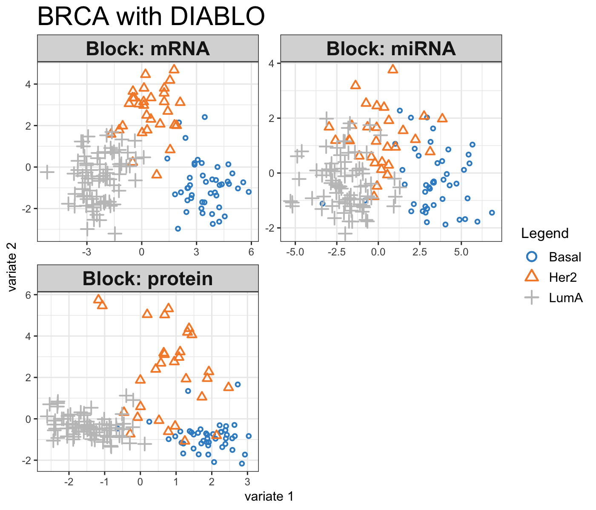

# Projection to Latent Structure (PLS) {#pls}


## Biological question
<span style="color:blue">
*I would like to integrate two data sets measured on the same samples by extracting correlated information, or by highlighing commonalities between data sets.*
</span>

## The `nutrimouse` study

The `nutrimouse` study contains the expression levels of genes potentially involved in nutritional problems and the concentrations of hepatic fatty acids for forty mice. The data sets come from a nutrigenomic study in the mouse from our collaborator [@Mar07], in which the effects of five regimens with contrasted fatty acid compositions on liver lipids and hepatic gene expression in mice were considered. Two sets of variables were measured on 40 mice:

- `gene`: the expression levels of 120 genes measured in liver cells, selected among (among about 30,000) as potentially relevant in the context of the nutrition study. These expressions come from a nylon microarray with radioactive labelling.

- `lipid`: concentration (in percentage) of 21 hepatic fatty acids measured by gas chromatography. 

- `diet`: a 5-level factor. Oils used for experimental diets preparation were corn and colza oils (50/50) for a reference diet (REF), hydrogenated coconut oil for a saturated fatty acid diet (COC), sunflower oil for an Omega6 fatty acid-rich diet (SUN), linseed oil for an Omega3-rich diet (LIN) and corn/colza/enriched fish oils for the FISH diet (43/43/14).

- `genotype` 2-levels factor indicating either wild-type (WT) and PPAR$\alpha$ -/- (PPAR). 

More details can be found in `?nutrimouse`.

To illustrate sparse PLS, we will integrate the gene expression levels (`gene`) with the concentrations of hepatic fatty acids (`lipid`).

## Principle of PLS

Partial Least Squares (PLS) regression [@Wol66; @Wol01] is a multivariate methodology which relates (\textit{integrates}) two data matrices `X` (e.g. transcriptomics) and `Y` (e.g. lipids). PLS goes beyond traditional multiple regression by modelling the structure of both matrices. Unlike traditional multiple regression models, it is not limited to uncorrelated variables. One of the many advantages of PLS is that it can handle many noisy, collinear (correlated) and missing variables and can also simultaneously model several response variables in `Y`. 

PLS is a multivariate projection-based method that can address different types of integration problems. Its flexibility is the reason why it is the backbone of most methods in `mixOmics`. PLS is computationally very efficient when the number of variables $p + q >> n$ the number of samples. It performs successive local regressions that avoid computational issues due to the inversion of large singular covariance matrices. Unlike PCA which maximizes the variance of components from a  single data set, PLS maximizes the covariance between components from two data sets. The mathematical concepts of covariance and correlation are similar, but the covariance is an unbounded measure and covariance has a unit measure (see \@ref(intro:background)). In PLS, linear combination of variables are called *latent variables* or *latent components*. The weight vectors used to calculate the linear combinations are called the *loading vectors*. Latent  variables and loading vectors are thus associated, and come in pairs from each of the two data sets being integrated. 

## Principle of sparse PLS
Even though PLS is highly efficient in a high dimensional context, the interpretability of PLS needed to be improved. sPLS has been recently developed by our team to perform simultaneous variable selection in both data sets `X` and `Y` data sets, by including LASSO $\ell_1$ penalizations in PLS on each pair of loading vectors [@Lec08].


## Inputs and outputs
We consider the data input matrices: `X` is a $n \times p$ data matrix and `Y` a $n \times q$ data matrix, where $n$ the number of samples (individuals), $p$ and $q$ are the number of variables in each data set. PLS main outputs are:

- A **set of components**, also called latent variables associated to each data set. There are as many components as the chosen dimension of the PLS.

- A **set of loading vectors**, which are coefficients assigned to each variable to define each component. Those coefficients indicate the importance of each variable in PLS. Importantly, each loading vector is associated to a particular component. Loading vectors are obtained so that the covariance between a linear combination of the variables from `X` (the X-component) and from `Y` (the $Y$-component) is maximised.

- A **list of selected variables** from both `X` and `Y` and associated to each component if sPLS is applied. 

## Set up the data

We first set up the data as `X` expression matrix and `Y` as the lipid abundance matrix. We also check that the dimensions are correct and match:


```r
library(mixOmics)
data(nutrimouse)
X <- nutrimouse$gene  
Y <- nutrimouse$lipid
dim(X); dim(Y)
```

```
## [1]  40 120
```

```
## [1] 40 21
```

## Quick start

We will mainly focus on sparse PLS for large biological data sets where variable selection can help the interpretation of the results. See `?pls` for a model with no variable selection. Here we arbitrarily set the number of variables to select to 50 on each of the 2 components of PLS (see section \@ref(tuning:PLS) for tuning these values).


```r
MyResult.spls <- spls(X,Y, keepX = c(25, 25), keepY = c(5,5))  # 1 Run the method
plotIndiv(MyResult.spls)                                       # 2 Plot the samples
```

```r
plotVar(MyResult.spls)                                         # 3 Plot the  variables
```

If you were to run `spls` with this minimal code, you would be using the following default values:

- `ncomp = 2`: the first two PLS components are calculated and are used for graphical outputs;
- `scale = TRUE`: data are scaled (variance = 1, strongly advised here);
- `mode = "regression"`: by default a PLS regression mode should be used (see \@ref(PLS:details) for more details) .

Because PLS generates a pair of components, each associated to each data set, the function `plotIndiv` produces 2 plots that represent the same samples projected in either the space spanned by the X-components, or the Y-components. A single plot can also be displayed, see section \@ref(pls:plotIndiv).

## To go further {#pls-tgf}

### Customize sample plots {#pls:plotIndiv}

Some of the sample plot additional arguments were described in \@ref(splsda:plotIndiv). In addition, you can choose the representation space to be either the components from the `X`-data set, the `Y`- data set, or an average between both components `rep.space = 'XY-variate'`. See more examples in `examples(plotIndiv)` and on our [website](http://mixomics.org/graphics/sample-plots/). Here are two examples with colours indicating genotype or diet:


```r
plotIndiv(MyResult.spls, group = nutrimouse$genotype,
          rep.space = "XY-variate", legend = TRUE,
          legend.title = 'Genotype',
          ind.names = nutrimouse$diet,
          title = 'Nutrimouse: sPLS')
```


```r
plotIndiv(MyResult.spls, group=nutrimouse$diet,
          pch = nutrimouse$genotype,
          rep.space = "XY-variate",  legend = TRUE,
          legend.title = 'Diet', legend.title.pch = 'Genotype',
          ind.names = FALSE, 
          title = 'Nutrimouse: sPLS')
```




### Customize variable plots {#pls:plotVar}
See (`example(plotVar)`) for more examples. Here we change the size of the labels. By default the colours are assigned to each type of variable. The coordinates of the variables can also be saved as follows:


```r
plotVar(MyResult.spls, cex=c(3,2), legend = TRUE)
```


```r
coordinates <- plotVar(MyResult.spls, plot = FALSE)
```


### Other useful plots for data integration

We extended other types of plots, based on clustered image maps and relevance networks to ease the interpretation of the relationships between two types of variables. A similarity matrix is calculated from the outputs of PLS and represented with those graphics, see [@Gon12] for more details, and our [website](http://mixomics.org/graphics/variable-plots/) 

#### Clustered Image Maps
A clustered image map can be produced using the `cim` function. You may experience figures margin issues in RStudio. Best is to either use `X11()` or save the plot as an external file. For example to show the correlation structure between the X and Y variables selected on component 1:


```r
X11()
cim(MyResult.spls, comp = 1)
cim(MyResult.spls, comp = 1, save = 'jpeg', name.save = 'PLScim')
```

#### Relevance networks {#pls:network}
Using the same similarity matrix input in CIM, we can also represent relevance bipartite networks. Those networks only represent edges between on type of variable from `X` and the other type of variable, from `Y`. Whilst we use sPLS to narrow down to a few key correlated variables, our `keepX` and `keepY` values might still be very high for this kind of output. A cut-off can be set based on the correlation coefficient between the different types of variables.

Other arguments such as `interactive = TRUE` enables a scrollbar to change the cut-off value interactively, see other options in `?network`. Additionally, the graph object can be saved to be input into Cytoscape for an improved visualisation.


```r
X11()
network(MyResult.spls, comp = 1)
network(MyResult.spls, comp = 1, cutoff = 0.6, save = 'jpeg', name.save = 'PLSnetwork')
# save as graph object for cytoscape
myNetwork <- network(MyResult.spls, comp = 1)$gR
```


#### Arrow plots
Instead of projecting the samples into the combined XY representation space, as shown in \@ref(pls:plotIndiv), we can overlap the X- and Y- representation plots. One arrow joins the same sample from the X- space to the Y- space. Short arrows indicate a good agreement found by the PLS between both data sets.


```r
plotArrow(MyResult.spls,group=nutrimouse$diet, legend = TRUE,
          X.label = 'PLS comp 1', Y.label = 'PLS comp 2')
```


### Variable selection outputs

The selected variables can be extracted using the `selectVar` function for further analysis.


```r
MySelectedVariables <- selectVar(MyResult.spls, comp = 1)
MySelectedVariables$X$name # Selected genes on component 1
```

```
##  [1] "SR.BI"   "SPI1.1"  "PMDCI"   "CYP3A11" "Ntcp"    "GSTpi2"  "FAT"    
##  [8] "apoC3"   "UCP2"    "CAR1"    "Waf1"    "ACOTH"   "eif2g"   "PDK4"   
## [15] "CYP4A10" "VDR"     "SIAT4c"  "RXRg1"   "RXRa"    "CBS"     "SHP1"   
## [22] "MCAD"    "MS"      "CYP4A14" "ALDH3"
```

```r
MySelectedVariables$Y$name # Selected lipids on component 1
```

```
## [1] "C18.0"    "C16.1n.9" "C18.1n.9" "C20.3n.6" "C22.6n.3"
```


The loading plots help visualise the coefficients assigned to each selected variable on each component:

```r
plotLoadings(MyResult.spls, comp = 1, size.name = rel(0.5))
```


### Tuning parameters and numerical outputs {#tuning:PLS}

For PLS and sPLS, two types of parameters need to be chosen:

1 - The number of components to retain `ncomp`,
2 - The number of variables to select on each component and on each data set `keepX` and `keepY` for sparse PLS.

For **item 1** we use the `perf` function and repeated k-fold cross-validation to calculate the Q$^2$ criterion used in the SIMCA-P software [@Ume96]. The rule of thumbs is that a PLS component should be included in the model if its value is $\leq 0.0975$. Here we use 3-fold CV repeated 10 times (note that we advise to use at least 50 repeats, and choose the number of folds that are appropriate for the sample size of the data set). 

We run a PLS model with a sufficient number of components first, then run `perf` on the object.


```r
MyResult.pls <- pls(X,Y, ncomp = 4)  
set.seed(30) # for reproducbility in this vignette, otherwise increase nrepeat
perf.pls <- perf(MyResult.pls, validation = "Mfold", folds = 5,
                  progressBar = FALSE, nrepeat = 10)
plot(perf.pls$Q2.total)
abline(h = 0.0975)
```


This example seems to indicate that up to 3 components could be enough. In a small $p+q$ setting we generally observe a Q$^2$ that decreases, but that is not the case here as  $n << p+q$.

**Item 2** can be quite difficult to tune. Here is a minimal example where we only tune `keepX` based on the Mean Absolute Value. Other measures proposed are Mean Square Error, Bias and R2  (see `?tune.spls`):


```r
list.keepX <- c(2:10, 15, 20)
# tuning based on MAE
set.seed(30) # for reproducbility in this vignette, otherwise increase nrepeat
tune.spls.MAE <- tune.spls(X, Y, ncomp = 3,
                           test.keepX = list.keepX,
                           validation = "Mfold", folds = 5,
                           nrepeat = 10, progressBar = FALSE,
                           measure = 'MAE')
plot(tune.spls.MAE, legend.position = 'topright')
```


Based on the lowest MAE obtained on each component, the optimal number of variables to select in the `X` data set, including all variables in the `Y` data set would be:


```r
tune.spls.MAE$choice.keepX
```

```
## comp1 comp2 comp3 
##    15     2    20
```

Tuning `keepX` and `keepY` conjointly is still work in progress. What we advise in the meantime is either to adopt an arbitrary approach by setting those parameters arbitrarily, depending on the biological question, or tuning one parameter then the other.


### PLS modes {#PLS:details}

You may have noticed the `mode` argument in PLS. We can calculate the residual matrices at each PLS iteration differently. Note: this is fore **advanced** users.

#### Regression mode 
The PLS regression mode models a 'causal' (or, rather, *uni-directional*) relationship between two data sets. The `Y` matrix is deflated with respect to the information extracted/modelled from the local regression on X. Here the goal is to predict `Y` from `X` (`Y` and `X` play an *assymmetric role*). Consequently the latent variables computed to predict Y from X are different from those computed to predict X from Y. More details about the model can be found in[ Appendix [@Lec08]. 

PLS regression mode, also called PLS2, is commonly applied for the analysis of biological data [@Bou05; @Byl07] due to the biological assumptions or the biological dogma. In general, the number of variables in `Y` to predict are fewer in number than the predictors in `X`. 

#### Canonical mode
Similar to a Canonical Correlation Analysis (CCA) framework, this mode is used to model a *{bi-directional* (or *symmetrical*) relationship between the two data sets.  The `Y` matrix is deflated with respect to the information extracted or modelled from the local regression on `Y`. Here `X` and `Y` play a symmetric role and the goal is similar to CCA. More details about the model can be found in [@Lec09a]. 

PLS canonical mode is not well known (yet), but is applicable when there is no *a priori* relationship between the two data sets, or in place of CCA but when variable selection is required in large data sets. In [@Lec09a], we compared the measures of the same biological samples on different types of microarrays, cDNA and Affymetrix arrays, to highlight complementary information at the transcripts levels. Note however that for this mode we do not provide any tuning function.


#### Other modes
The 'invariant' mode performs a redundancy analysis, where the `Y` matrix is not deflated. The 'classic' mode is similar to a regression mode. It gives identical results for the variates and loadings associated to the `X` data set, but differences for the loadings vectors associated to the Y data set (different normalisations are used). Classic mode is the PLS2 model as defined by [@Ten98], Chap 9. 


#### Difference between PLS modes
For the first PLS dimension, all PLS modes will output the same results in terms of latent variables and loading vectors. After the first dimension, these vectors will differ, as the  matrices are deflated differently. 

## Additional resources
 
Additional examples are provided in `example(spls)`  and in our case studies on our [website](http://www.mixomics.org) in the **Methods** and **Case studies** sections, see also [@Lec08; @Lec09a].


## FAQ

* Can PLS handle missing values?
    + Yes it can, but only for the learning / training analysis. Prediction with `perf` or `tune` is not possible with missing values.


* Can PLS deal with more than 2 data sets?
    + sPLS can only deal with 2 data sets, but see `DIABLO` (Chapter \@ref(diablo)) for multi-block analyses


* What are the differences between sPLS and Canonical Correlation Analysis (CCA, see `?rcca` in mixOmics)?
    + CCA maximises the correlation between components; PLS maximises the covariance
    + Both methods give similar results if the components are scaled, but the underlying algorithms are different:
        - CCA calculates all component at once, there is no deflation
        - PLS has different deflation mode
    + sparse PLS selects variables, CCA cannot perform variable selection
  
  
* Can I perform PLS with more variables than observations?
    + Yes, and sparse PLS is particularly useful to identify sets of variables that play a role in explaining the relationship between two data sets.


* Can I perform PLS with 2 data sets that are highly unbalanced (thousands of variables in one data set and less than 10 in the other ?
    + Yes! Even if you performed sPLS to select variables in one data set (or both), you can still control the number of variables selected with `keepX`.

